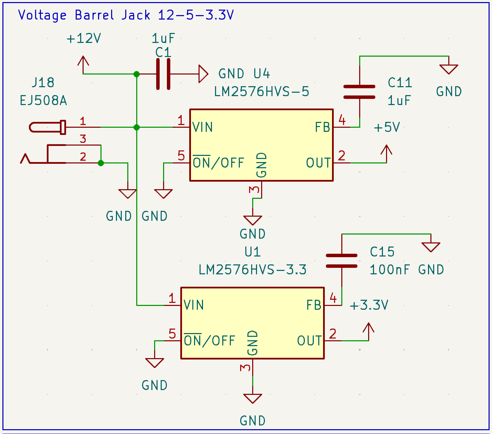
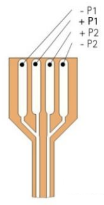
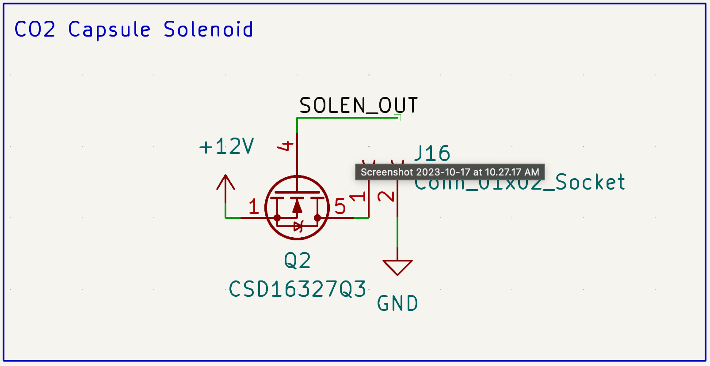

# Ion Concentration Biomodulator Audit
# Introduction
The purpose of the chip is to enable an incubator to dispense ions over a cellular culture within the incubator. It consists of the following main parts:
- STM32F4 MCU
- 12V Barrel Jack, 12V-5V LDO, 12V-3.3V LDO
- CO2/Humidity/Temperature IC
- highdriver4 micropump driver and 4x mp6 micropumps
- Tag-Connect Debug port
- 4x Flow sensors 
- Peltier Cooler
- CO2 Capsule
## Voltage Barrel Jack

#### Electrical Specifications
- *EJ508A Barrel Jack*
	- Datasheet: https://www.memoryprotectiondevices.com/datasheets/EJ508A-datasheet.pdf
	- Maximum Voltage: 12V
	- Maximum Current: 5A
- *LM2576 LDO*
	- Datasheet: https://www.ti.com/lit/ds/symlink/lm2576.pdf
	- Maximum Supply Voltage: 60V
	- ==Maximum Current: Unknown==
	- Output Voltage: 3.3V/5V
	- Output Current: 3A
#### Function
The voltage barrel jack splits the incoming power into a 12V line, 5V line and 3.3V line.  Two LDOs are connected in parallel. This will supply the entire board
#### Concerns
- The greatest current drawing component is the Peltier cooler which is connected to the 12V line and pulls 3.8A. Note that the 12V line is not limited to 3A so it should be able to supply it completely, however, there may not be enough current for the rest of the device or if it will distribute current correctly

## Sensor IC

#### Electrical Specifications
- *SCD41*
	- Datasheet: https://sensirion.com/media/documents/48C4B7FB/64C134E7/Sensirion_SCD4x_Datasheet.pdf
	- Minimum Voltage: 2.4
	- Maximum Voltage: 5.5V
	- Peak Supply Current: 
		- 175 typical mA to 205 max mA @ 3.3V
		- 115 typical mA to 137 max mA @ 5V
#### Function
The IC will do all the basic sensing of CO2/Humidity/Temperature and send it to the STM32
#### Concerns
- The footprint for the SCD41 looks similar to the SCD40 but it is supposed to be a connector with a detachable

## Highdriver4

#### Electrical Specifications
- *highdriver4*
	- Datasheet: https://www.repcomsrl.com/wp-content/uploads/2021/04/mp6_electronics_Datasheet.pdf
	- Minimum Voltage: 2.4V
	- Maximum Voltage: 5.5V
	- Input supply current: 75mA
- *mp6 micropump*
	- Datasheet: https://mm.digikey.com/Volume0/opasdata/d220001/medias/docus/5561/mp6%20micropumps.pdf
	- Output voltage: 250 Vpp
- *Molex Connector*
	- Datasheet: https://www.molex.com/en-us/products/part-detail/39532045?display=pdf
#### Function
The highdriver4 will drive all 4 micropumps to dispense ions to the cells. The micropumps are connected via molex connectors
#### Concerns
- Will there be crosstalk between signals since high output voltage of mp6 
- Want to double check that all pins are connected correctly
**highdriver4 pins**

**mp6 micropump**

## Serial Wire Debug Port
- *mp6 micropump*
	- Datasheet: https://mm.digikey.com/Volume0/opasdata/d220001/medias/docus/2084/TC2030-IDC_RevB.pdf
#### Function
The Tag-Connect will be used to debug the PCB
#### Concerns
- Want to ensure the mechanically – this will fit without any issus

	- Design specifications are:
		- Traces must be more than 0.2mm outside of the keep-out area
		- Large components should not block the area
		- Don't deposit solder paste on contact area
		- Don't put vias between contact pads
## Peltier Cooler

#### Electrical Specifications
- *Peltier Cooler*
	- Datasheet: https://www.lairdthermal.com/datasheets/datasheet-PCX4-4-F1-1515-TA-RT-W6.pdf
	- Maximum Voltage: 5.7V
	- Maximum Current: 4.1A
#### Function
This Peltier cooler will provide temperature control for the incubator
#### Concerns

## Solenoid

#### Electrical Specifications
- *CO2 Solenoid*
	- Datasheet: https://mm.digikey.com/Volume0/opasdata/d220001/medias/docus/778/B12P-XXX-B-3.pdf
	- Voltage: 12V
	- Maximum Current: ==400mA (Double check this)==
#### Function
This solenoid will add CO2 to the incubator 
#### Concerns
### Flow Sensors

#### Electrical Specifications
- *Liquid Sensors*
	- Datasheet: https://sensirion.com/media/documents/C4F8D965/65290BC3/LQ_DS_SLF3S-0600F_Datasheet.pdf
	- Voltage Range: 3.2-3.8V
	- Maximum Current: 4.5-6mA
#### Function
These sensors will be used to measure the amount of liquid flowing in and out of the cell
#### Concerns
- Ensure that the pins ordered
- Am I using the right footprint?
### STM32F4

#### Electrical Specifications
- STM32
	- Datasheet: https://sensirion.com/media/documents/C4F8D965/65290BC3/LQ_DS_SLF3S-0600F_Datasheet.pdf
	- Voltage Range: 1.7V - 3.6 V
	- Maximum Current: 4.5-6mA
#### Function
The MCU controls all the devices and also takes in sensor data
#### Concerns
